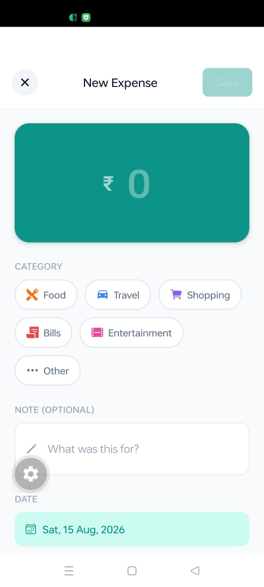
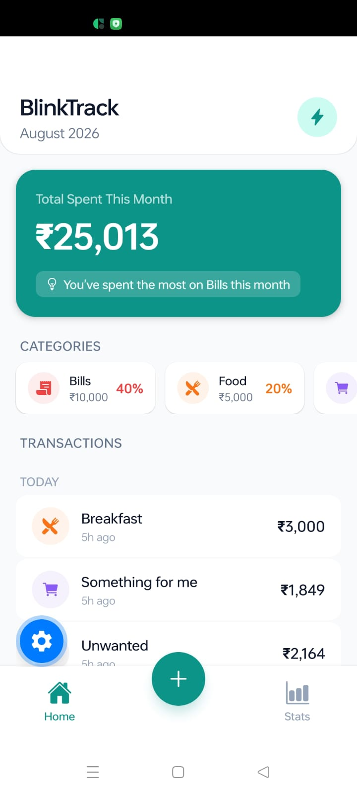
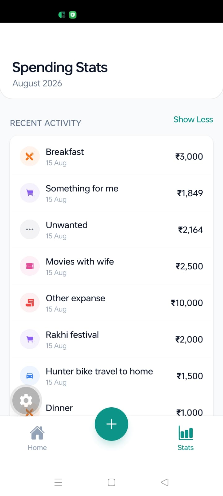
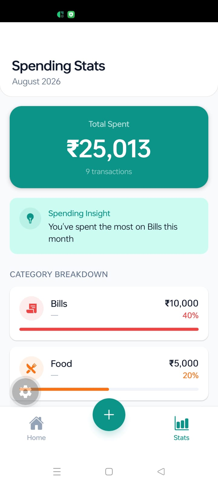

<div align="center">

# BlinkTrack

A clean, modern expense tracker built with React Native (Expo) for the **BlinkMoney Frontend Engineering Hiring Assignment**.

[](https://reactnative.dev/)
[](https://expo.dev/)
[](LICENSE)

</div>

---

## Demo

<div align="center">

| Home (Empty) | Home (Transactions) | Add Expense | Stats |
|:---:|:---:|:---:|:---:|
|  |  |  |  |

</div>

---

## About

**BlinkTrack** is a mobile-first expense tracker app designed with a fintech-inspired UI. It allows users to log daily expenses, categorize them, and visualize spending patterns — all stored locally on the device.

Built as part of the BlinkMoney Frontend Engineering Hiring Assignment, the app showcases:

- Feature-based architecture
- Reusable component design
- Smooth interactions and transitions
- Polished mobile-first UI/UX
- Local data persistence

---

## Features

### Home Screen
- Monthly expense summary card with total spent
- Horizontal scrollable category chips with amounts and percentages
- Date-grouped transaction list with pull-to-refresh
- Empty state with helpful onboarding message

### Add Expense
- Teal amount input card with currency symbol
- Category grid with 12 expense categories
- Optional note input
- Date display (auto-set to today)
- Validation with alert prompts

### Stats Screen
- Total spent and transaction count summary
- Category breakdown with progress bars
- Recent activity list with View All / Show Less toggle
- Monthly statistics at a glance

### General
- Bottom tab navigation with centered "+" button
- Pull-to-refresh on transaction lists
- Local persistence with AsyncStorage
- Smooth transitions and animations
- Responsive layout for all screen sizes

---

## Tech Stack

| Layer | Technology |
|---|---|
| **Framework** | React Native 0.86.2 |
| **Runtime** | Expo SDK 57 |
| **Routing** | Expo Router (file-based) |
| **Language** | JavaScript (ES6+) |
| **State** | React Hooks + Context |
| **Storage** | AsyncStorage (local) |
| **Icons** | Ionicons (@expo/vector-icons) |
| **Animations** | React Native Reanimated 4.5.1 |

---

## Libraries Used

| Library | Purpose |
|---|---|
| `expo` | Core Expo SDK and tooling |
| `expo-router` | File-based navigation and routing |
| `react-native` | Cross-platform mobile framework |
| `react-native-gesture-handler` | Touch gestures and swipe interactions |
| `react-native-reanimated` | Smooth animations and transitions |
| `react-native-safe-area-context` | Safe area insets for notch/status bar |
| `react-native-screens` | Native screen containers |
| `@react-native-async-storage/async-storage` | Local key-value storage |
| `@expo/vector-icons` | Icon library (Ionicons) |
| `expo-asset` | Asset management |
| `expo-constants` | App constants and config |
| `expo-status-bar` | Status bar control |
| `expo-linking` | Deep linking support |
| `uuid` | Unique ID generation |
| `react-dom` | React DOM for web support |
| `react-native-web` | Web platform support |

---

## Project Structure

```
BlinkTrack/
├── app/                          # Expo Router screens
│   ├── _layout.js                # Root Stack (tabs + modal)
│   ├── (tabs)/
│   │   ├── _layout.js            # Tab bar configuration
│   │   ├── index.js              # Home screen
│   │   ├── stats.js              # Stats screen
│   │   └── add.js                # Add tab redirect
│   └── add-transaction.js        # Add expense modal
├── features/
│   └── transactions/
│       ├── components/
│       │   ├── TransactionItem.js
│       │   ├── TransactionList.js
│       │   ├── CategoryChip.js
│       │   ├── CategoryBreakdown.js
│       │   └── EmptyState.js
│       ├── hooks/
│       │   └── useTransactions.js
│       └── utils/
│           └── helpers.js
├── shared/
│   ├── components/
│   │   └── LoadingSpinner.js
│   ├── constants/
│   │   └── theme.js
│   └── utils/
│       └── storage.js
├── assets/                       # App icons, splash, demo images
├── screenshots/                  # Demo screenshots for README
├── app.json                      # Expo config
├── metro.config.js               # Metro bundler config
├── package.json
└── README.md
```

---

## Getting Started

### Prerequisites

- Node.js 18+
- npm or yarn
- Expo CLI (`npm install -g expo-cli`)
- Expo Go app on your phone (or iOS/Android simulator)

### Installation

```bash
# Clone the repository
git clone https://github.com/Lokesh777/blinkMoney_expenseTracker.git

# Navigate to project
cd BlinkTrack

# Install dependencies
npm install

# Start the development server
npx expo start
```

### Running

- **Mobile**: Scan the QR code with Expo Go (iOS/Android)
- **Web**: Press `w` in the terminal
- **Simulator**: Press `i` (iOS) or `a` (Android)

---

## Design Decisions

- **Teal accent (#0D9488)**: Inspired by BlinkMoney's fintech aesthetic
- **Feature-based architecture**: Separate `features/` and `shared/` for scalability
- **Local-first**: All data persists in AsyncStorage — no backend required
- **Centered FAB**: Add button positioned in the center of the tab bar for quick access
- **Rounded cards**: 12px border radius throughout for a modern, approachable feel

---

## Author

**Lokesh** — [GitHub](https://github.com/Lokesh777)

---

## Acknowledgments

- Built for the **BlinkMoney Frontend Engineering Hiring Assignment**
- UI inspired by modern fintech apps
- Developed with Expo and React Native
